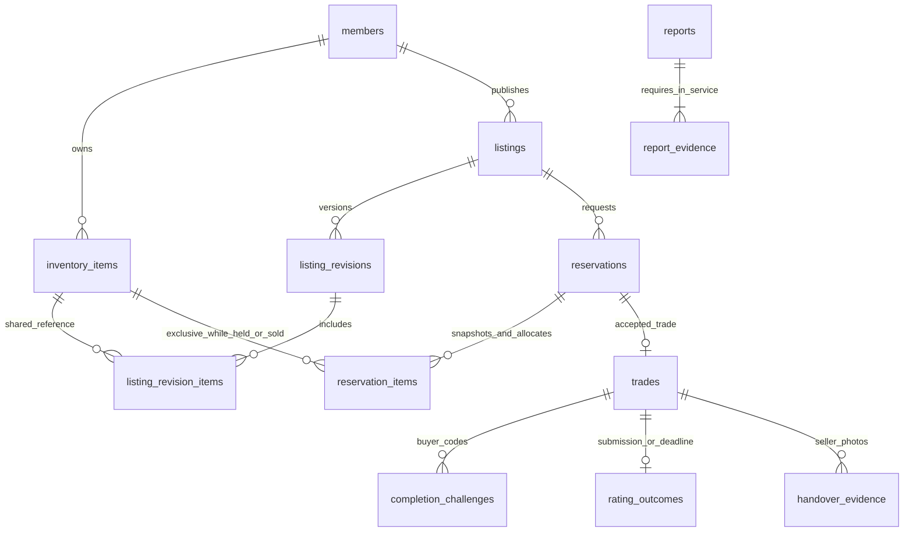
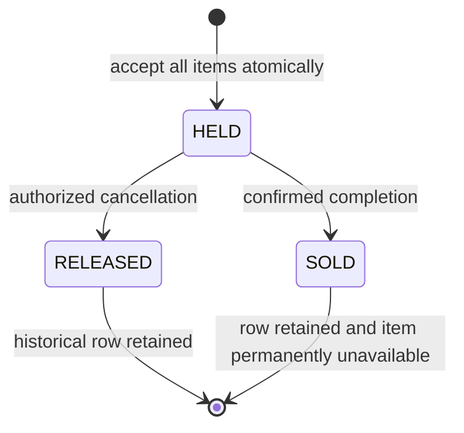

# Shared domain schema and transaction contract

Status: initial technical design for owner review, requirements v1.1. Migration
`backend/src/main/resources/db/migration/V2__shared_domain_foundation.sql` creates storage;
services and domain entities remain future work. See [API handoff](../api/README.md) for
policy gates, owners and executable checks. No business policy is approved by this schema.

Requirements v1.2/FR-19 adds a weekly giveaway-receipt limit with A20 details still
OPEN. The v1.1 schema has no giveaway-limit enforcement. Its absence of a general
buyer hold quota is preserved; it does not exempt giveaways from the new receipt
policy. M3/M4 with M1/M5 must review the approved counting unit, week boundary,
counting/check stage, cancellation and concurrent commands before defining storage
or enforcement. Do not derive a cap or counting unit from this schema or FR-18 reports;
add a new migration only if the resulting approved design requires one.

## Data dictionary by ownership

All new primary IDs use application-generated UUIDs; category IDs retain V1 bigint.
Time columns are `timestamptz`, prices bigint VND, versions nonnegative bigint.
Foreign keys default to restrictive deletion; history does not cascade away with accounts.

| Owner | Tables | Meaning / notable keys |
| --- | --- | --- |
| M1 | `members`, `member_roles` | Internal identity; normalized unique email, nullable unique MSSV; activation requires email + admin identity checks. Reputation cache starts 0 until atomic activation +100. Roles are separate from transaction buyer/seller |
| M2 + M5 | `media_assets` | Random storage UUID, owner, purpose, type, byte size. Composite key prevents restricted assets being used as listing photos. No client path/URL |
| M2 | `inventory_items` | One real physical object, seller-owned; no quantity or mutable availability flag |
| M2 | `listings`, `listing_revisions` | Stable seller/listing; revision holds content, category, price, study fields, coarse public area. Published pointer must belong to same listing/seller. Publication and review states are separate |
| M2 | `listing_revision_items`, `listing_revision_photos` | Revision/item many-to-many; same-seller composite FKs. Photo positions 1–5. Service checks nonempty items and at least one photo before submission |
| M5 | `listing_reviews` | Reviewer, specific revision, verdict/reason/time. Append audit decisions; service enforces reviewer authority and revision transition |
| M2 + M5 | `listing_events` | Append-only application audit of withdrawals/publication changes: actor, action, reason and time; write in the same transaction as the change |
| M3 | `conversations`, `messages`, `price_proposals` | One buyer/seller conversation per listing; proposal bound to revision and participants. Accepting price never allocates inventory |
| M3 | `reservations` | Request and lifecycle; accepted price, revision, JSON content snapshot and time; no buyer quota/expiry. One ACCEPTED or COMPLETED reservation per listing |
| M3 + M2 | `reservation_items` | Allocation plus immutable name/condition snapshot. HELD/SOLD unique by physical item across every listing. RELEASED preserves cancelled history; SOLD remains permanently exclusive |
| M3 | `appointments` | Current meeting details; version mirrors owning reservation after update. History/acceptance refinements belong to meeting implementation |
| M4 | `trades`, `handover_evidence` | One trade per reservation with matching buyer/seller. Seller-owned HANDOVER asset links. First handover establishes +24h review deadline; completion establishes +360h rating deadline |
| M4 | `completion_challenges` | Buyer-bound keyed verifier; exact 10-minute lifetime, failed attempts 0–5, single current unconsumed/uninvalidated row. Expiry alone does not remove uniqueness; reissue explicitly invalidates old row |
| M4 + M5 | `rating_outcomes` | PK trade ID selects SUBMITTED or NO_RATING. Submitted keeps stars/review status even if rejected or removed. It is not an auto-generated star rating |
| M5 | `reports`, `report_evidence`, `moderation_decisions` | Account target with optional listing/trade, duplicate link, protected evidence; decision audit targets exactly one report/trade/rating. No numeric report sanction or implied authority |
| M1 | `reputation_entries` | Unique source key, single activation/member, single rating-or-no-rating effect/trade, unique reversal reference. No REPORT_PENALTY kind yet |
| M5 | `notifications` | Recipient + event key deduplicates inbox delivery; no reminder schedule is seeded |
| M1 shared infrastructure | `command_receipts` | Actor + operation + idempotency UUID, validated request hash, result ID/version/status; no cached secrets |

`listing_snapshot` is a server-created JSON object with `schemaVersion: 1`, `listingId`,
`revisionId` and `content` matching OpenAPI `ListingContent` at acceptance. Item name and
condition are copied separately into `reservation_items`. `agreed_price_vnd` is the
authoritative agreed price, which may differ from the advertised snapshot price after
an accepted proposal. Do not deserialize arbitrary buyer input into this snapshot.
Retain referenced photo assets while snapshots depend on them; retention policy remains
A12. JSON object validation in SQL is not full snapshot validation; service must populate
all required snapshot fields. Test fixtures with `{}` prove only the SQL shape boundary.

## Guarantees versus service obligations

| Invariant | PostgreSQL enforces now | Implementing application must additionally enforce |
| --- | --- | --- |
| Activation | Both verification timestamps and approving member exist | OTP proof, approved identity, authority, +100 ledger/cache exactly once; no automatic graduation ban |
| Listing content | Same seller links, revision belongs to listing, nonnegative/JS-safe prices, zero giveaways, at most 5 photo slots | Required content and study fields, item/photo lower bounds, immutable submitted revision and associations, photo inspection, target-listing edit guard |
| Exclusive hold | Unique live/completed reservation/listing and HELD/SOLD allocation/item | All-or-nothing full revision item set, current approved revision, participant eligibility, authorization and lock order |
| History | Accepted reservation content/actors/price/time and allocation snapshots cannot be changed; allocation rows cannot be deleted; terminal reservations/allocations cannot reopen | New revision for edits; prevent deletion/rewriting referenced submitted revisions/photos; do not treat related unavailable listing as completed |
| Publication quota | Storage separates publication/review from availability | Seller guard, 5/10 threshold, score-drop preservation; C38 public temporary shortage counts, sold shortage archives; A14 exact lifecycle/transaction mapping |
| Terminal result | One trade/reservation, sold items stay exclusive | Completion/cancellation state transition across all tables in one transaction; mandatory evidence and admin rationale; no automatic success |
| Challenges | Buyer FK, 10 minutes, max 5, one current row | Cryptographic six digits/keyed verifier, Clock checks, single use, durable failed attempts; invalidate at expiry/fifth failure, deny use independently of background jobs, no auto-generation; buyer-requested atomic reissue with fresh 10 minutes/zero failures; rate limits and action/actor checks (S8/C25) |
| Rating | One outcome/trade and one initial rating effect/trade | Buyer-only, completed trade, deadline boundary, correct seller/delta, negative approval, no changing SUBMITTED to NO_RATING; lock deadline job versus submission |
| Reputation reversal | Unique reversed entry reference | Same member, inverse original delta, authorized reason, preserve other incident effects and reconcile restrictions |
| Reports/evidence | Valid references and asset owner/purpose | Mandatory admissible evidence, target matches listing/trade, authorized case access, deduplicate canonical incident, no sanctions on submission |

The database is a final guard against collisions, not a replacement for services.

Requirements v1.4/S8/C25 confirms expired or five-failure codes are invalid, with
buyer-requested reissue and no automatic replacement. V2 storage supports the markers
but has no service enforcing these rules. Its current-row uniqueness is not a time
check: deny expired/exhausted codes even while `invalidated_at` is null. Reissue must
invalidate the old row before inserting the new row in one transaction; never reset
or revive an old code. Code invalidation neither cancels the trade nor releases items
or resets the 24-hour review deadline. Requirements v1.5/S9/C26 fixes the rate policy:
per buyer + trade, 60 seconds between successful issues, at most 3 successful issues
(initial + reissue) and 10 failed checks in `(now-15m, now]`. At 3 issues block issuance
only; at 10 failures block issuance/checking. Reissue does not reset shared failure
history; blocked requests add no events. V2 has issuance timestamps and per-code totals,
but no timestamped failed-check history or implementing service for the rolling window.
Do not infer precise window counts from a sum of per-code failures or reset all counts
after a fixed delay. M4/M3/M1 must review durable event/counter design and atomic checks;
if storage changes are needed, add a new migration rather than editing V2.
Do not claim a service requirement tested by creating arbitrary SQL rows. For example,
the schema permits a trade row linked to a requested reservation; only the acceptance
transaction may create it in the real application. Aggregate-state checks require the
transactional owner rather than cross-table CHECK expressions.

Requirements v1.6/S10/C27 confirms listing closure after 30 days unless renewed,
with a reminder 7 days before the deadline. A10 still leaves the clock origin,
renewal period/base, active-trade treatment and closure/reopening mapping unresolved.
V2 has listing creation/publication state and notification event keys, but no listing
deadline, renewal history or scheduler. `created_at` is not approval of a clock origin,
and `ARCHIVED` is not an approved mapping for every closure scenario. M2/M5 must
review deadline storage and deduplicated reminder/closure transactions with M1/M3/M4;
add a new migration when the design is agreed. Closing a listing must not silently
cancel a reservation, release shared items or change accepted history.

Requirements v1.7/S11/C28-C40 adds approved policies; storage does not implement them:

- Identity: registration OTP 5m/5 failures/60s, admin-reviewed alternative documents,
  one account per person and annual +7-day follow-up/Needs-update flag. No registration
  OTP, exception-verification or annual-cycle tables/DTOs exist. Unique email/student ID
  does not prove one real person has only one account; document sources remain A01/A13.
- Holds: one reminder to each party at acceptance +24h; notifications can deduplicate
  events but no scheduler/durable due-event service exists. Do not expire reservations.
- Post-handover cancellation: the other party enters a separate cancellation code.
  No such code table/DTO/API exists. Completion challenge storage must not be reused
  without an action/actor design; cancellation-code lifetime/limits remain A06.
- Admin response: 3 working days, not automatic resolution; response clock/calendar
  remain A06. Handover photos need not expose faces; exact viewer roles/retention remain A12.
- Ratings: edit within the original 15-day window before review decision, re-review;
  only accepted versions public, in-app appeal within 7 days. V2 stores one outcome,
  not revision/appeal history; A07 must settle appeal origin and point/review semantics
  before designing new migrations/contracts. Never create a second outcome or allow +1
  because an existing submission was edited/rejected.
- Restrictions: moderators verify/propose, senior admins decide permanent bans/exceptions;
  another appeal reviewer where possible. Same incident yields one restriction decision,
  new violations use the later end date and permanent restriction takes precedence.
  Permanent-ban history/appeal and admin assistance require server permissions.
  No restriction/appeal/canonical-incident tables or service exist; exact penalties remain A08.
- Listings: edited submission temporarily hides; public temporary shortage counts toward
  quota, sold-item shortage archives; held/sold inventory is immutable. Admin removal
  of held listings separately reviews the trade. Update listing state, quota effects
  and allocations under common guards, preserving snapshots; lifecycle details remain A14.
- Barter: deferred to an extension; no barter contracts/tables in the current slice.

Owners M1-M5 must review new contracts/storage together; add migrations rather than
modifying V2. Foundation constraints/DTO tests do not verify these application rules.

## Lock protocol (shared technical starting contract)

Use one Spring transaction with PostgreSQL row locks. Operations may first read immutable
IDs without locks to discover guards; **recheck** them after locking. All participants
must follow the same order; never upgrade to an earlier guard later in the transaction.

1. Member guards in ascending UUID order: affected seller/buyer and any reputation subject.
   Role checks alone need not lock unrelated administrator accounts. Reputation changes,
   activation/restrictions and publication use these same member guards.
2. Listing guards in ascending UUID order; then the involved revision row. Hold/edit/
   moderation must lock the target listing before reading its definitive revision/items.
3. Physical item guards in ascending UUID order for the definitive item set.
4. Reservation, trade, challenge/outcome/ledger rows, then receipts/notification writes.

For a command targeting an existing reservation/trade, discover participant/listing/item
IDs first and acquire guards in this order before locking that aggregate. If an initial
read is stale, restart or return 409; do not append out-of-order locks. Recheck expected
version, actor access and all states under the guards. The same order applies to future
rating/reputation and admin terminal paths. Retry an actual database deadlock/serialization
failure only with bounded attempts and idempotent command semantics.

**Accept:** verify approved/eligible listing and accepted proposal belongs to this buyer
and revision; freeze the definitive snapshot, transition request to ACCEPTED, insert ALL
HELD allocations, create one trade and notification/receipt. Commit together. If one
item is occupied, roll back everything. There is no buyer count or hold-expiry timestamp.

**Edit B while A holds a shared item:** check B's own live hold/completion, create B's new
revision, leave A's reservation/allocations untouched. Do not release shared allocations
or edit the inventory object through listing DTOs. Revision publication needs moderation.
S11/C38 hides B when its edited revision is submitted, not merely on draft creation;
private old-revision access/rejected-edit behavior remains A14. Held/sold inventory is
immutable. The two-pointer storage alone does not enforce submission hiding.

**Complete:** under the same guards verify photo-backed handover and buyer challenge or
an authorized evidence-backed admin decision; mark challenge consumed, reservation/trade
completed, allocations SOLD, timestamps and notification/receipt atomically. Completion
does not itself add reputation. Keep SOLD rows; another listing cannot reuse these objects.

**Cancel before handover:** terminalize the reservation/trade if present, change its HELD
allocations to RELEASED, record actor/reason and notify peer in one transaction. A pending
request cancellation has no allocations. Never change publication to PUBLISHED without
approval/eligibility/quota checks. After handover this endpoint returns conflict; mutual/
admin cancellation is a separate gated workflow, not a bypass of the guard.

**Rate/deadline:** lock member/listing/item/reservation/trade in the common order as needed
before checking completion/deadline/outcome. Use `[completedAt, ratingDueAt)` for submission;
at the deadline the job may insert NO_RATING only if no outcome exists. SUBMITTED always
blocks +1, including pending/rejected/removed. Apply eligible ledger entry and cached score
in the same transaction; admin negative review reuses this boundary. Do not send a mail
or network request while holding database locks. Inbox entries are transactional; external
delivery/outbox implementation is deferred.

## Relationships and allocation lifecycle

Only the reservation with the SOLD allocation has a real completed trade. A combo sharing
one sold object has derived SOLD availability, not a fabricated completed transaction.
These are design diagrams for V2, supplementing the unchanged
[business analysis](../uml/marketplace-lifecycle.md).
