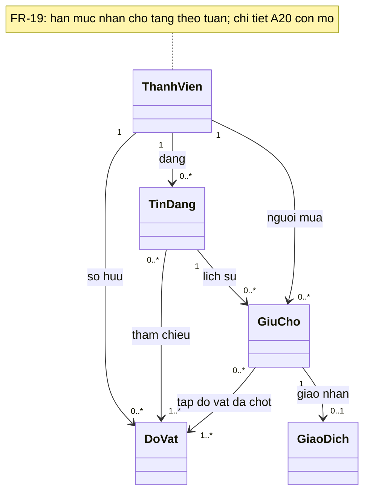
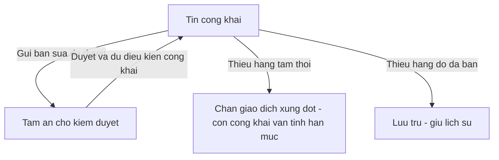
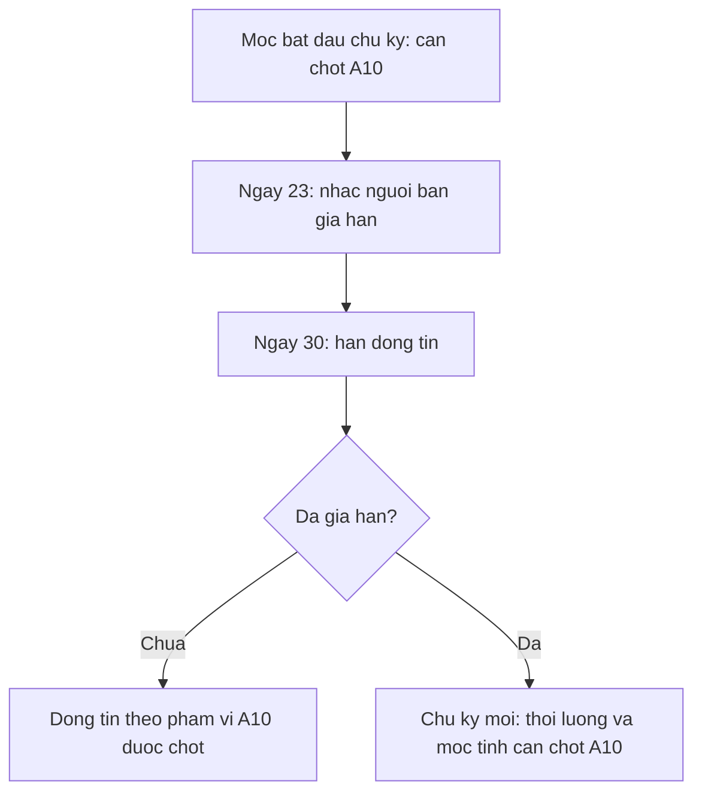
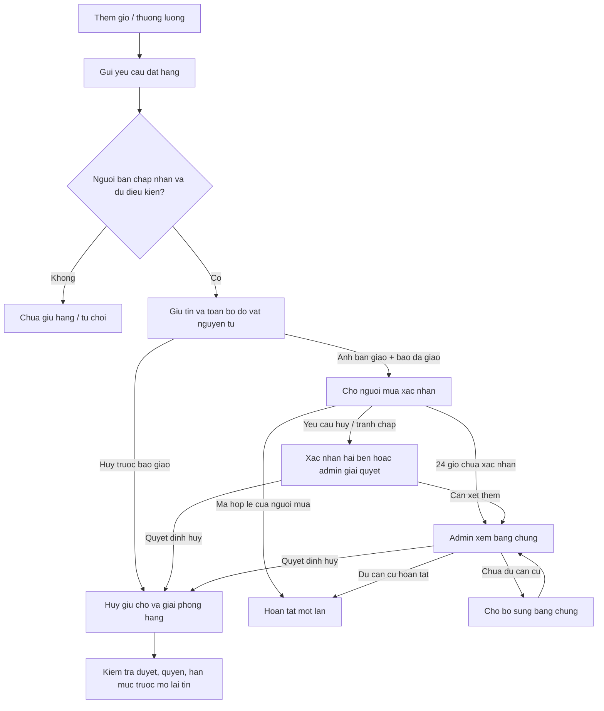
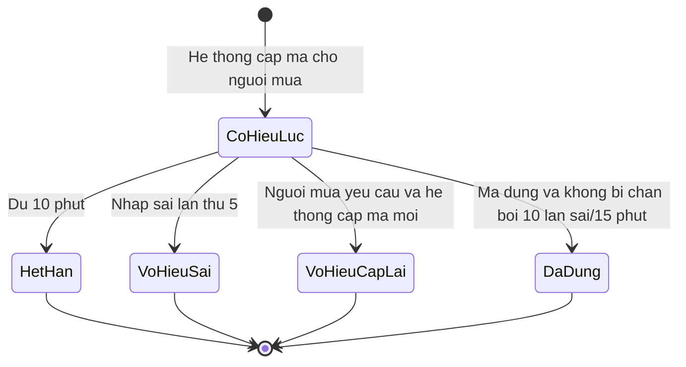
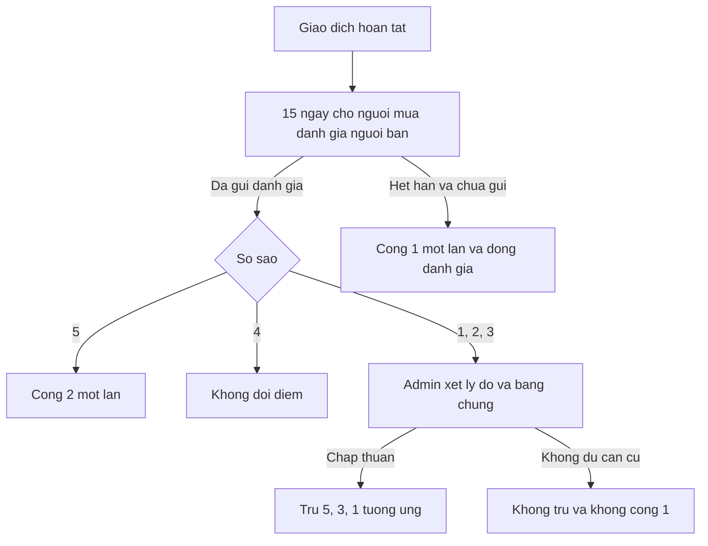
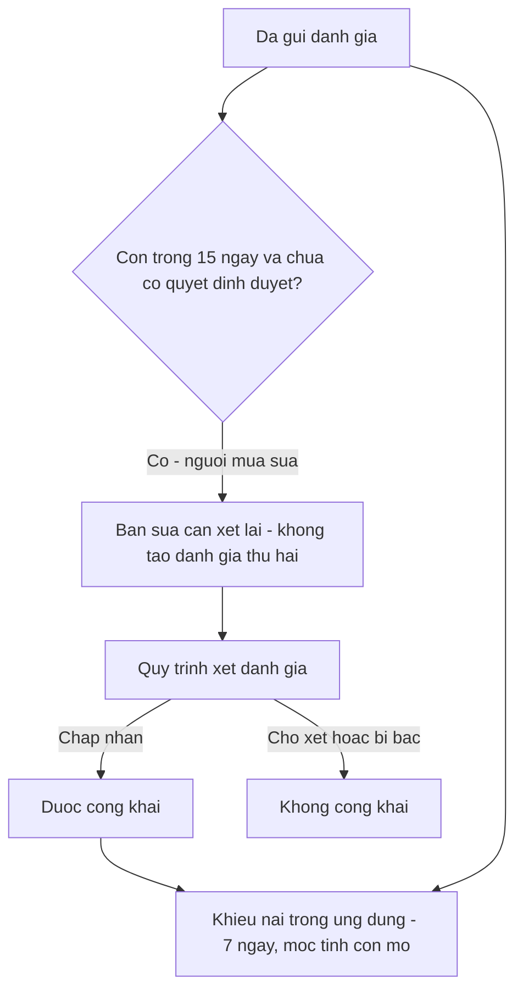
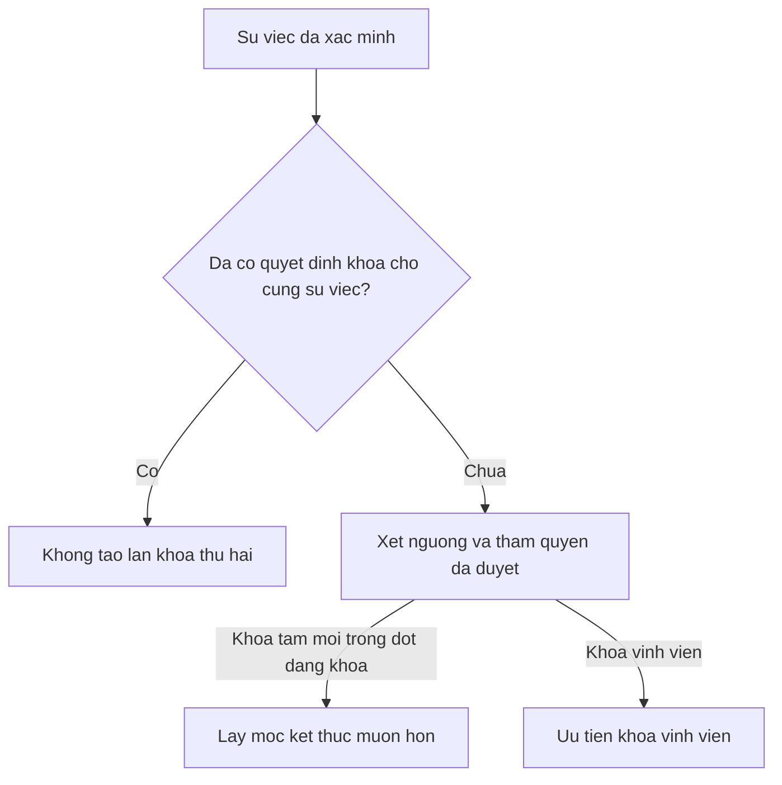

# Mô hình nghiệp vụ sau các quyết định P0

Ngày soạn: 28/09/2026; cập nhật: 05/10/2026. Nguồn: [yêu cầu v1.7, S5–S11](../product/client-requirements.md). Đây là mô hình phân tích minh họa các quy tắc đã chốt, **chưa phải thiết kế lớp/schema, máy trạng thái đầy đủ hoặc chức năng đã lập trình**. Chủ trì M2/M3/M4; M1 và M5 cùng review ranh giới quyền, điểm và kiểm duyệt. Đổi đồ đã chốt hoãn sang bản mở rộng tại S11/C39/A17.

Bổ sung 05/10/2026 theo yêu cầu v1.2/S6/C24: FR-19 yêu cầu hạn mức nhận cho tặng theo tuần, vẫn không xét hoàn cảnh. Số lần, kỳ tính, đơn vị đếm và bước kiểm tra còn mở tại A20; sơ đồ chưa chọn vị trí kiểm tra/ghi nhận lượt. M3/M4 phối hợp M1/M5 review sau khi khách hàng chốt. Không biến quy tắc này thành hạn mức giữ chỗ chung của người mua.

## Danh tính và cập nhật hồ sơ — FR-01–02, A01/A13

S11/C28,C37: OTP email + admin duyệt thẻ cho luồng thường, OTP đăng ký 5 phút/5 lần sai/gửi lại sau 60 giây; admin xét giấy tờ thay thế cho ngoại lệ, mỗi người một tài khoản. Hồ sơ hằng năm chưa cập nhật thì nhắc lại sau 7 ngày và đánh dấu “Cần cập nhật”, không tự khóa. Nguồn giấy tờ, luồng thiếu email và vòng đời OTP còn cần đặc tả; chưa có dịch vụ/schema thực thi.

## Kho cá nhân và tin đăng — FR-04/08, A02/A19

- Các bội số giữ chỗ là **lịch sử**, không phải số được giữ đồng thời: tối đa một giữ chỗ có hiệu lực/tin và một giữ chỗ có hiệu lực/đồ vật. Đồ vật đã bán không được giữ lại qua tin khác.
- Một bản ghi kho đại diện một vật thực tế. Tin chỉ tham chiếu đồ vật của người bán đó. Combo có nhiều đồ vật, được giữ tất cả hoặc không giữ món nào. Người mua không có hạn mức số giữ chỗ chung. Hạn mức nhận cho tặng theo tuần FR-19 tách riêng; cách tính combo và tác động tới giữ chỗ/hoàn tất cần chốt A20.
- Sửa/rút xét **chính tin bị tác động**: tin B chưa được giữ vẫn được sửa/rút khi tin A đang giữ đồ vật chung. S11/C38 chốt tạm ẩn B khi gửi bản sửa để duyệt; không sửa kho đang giữ/đã bán, thỏa thuận A hoặc giải phóng đồ vật A. Tạo nháp sửa không phải bước gửi kiểm duyệt.
- Khi bàn bán qua tin A, combo B không đủ hàng được lưu trữ theo S11/C38, không ghi thành giao dịch hoàn tất của B. Thiếu hàng tạm thời vì tin khác giữ vẫn tính hạn mức nếu tin còn công khai.

Từ chối bản sửa, quyền xem lịch sử và xử lý tin đang có giao dịch còn cần đặc tả A14. Admin gỡ tin đang giữ xem xét giao dịch riêng, không tự hủy hoặc giải phóng hàng.

## Thời hạn tin đăng — FR-13, A10

Bổ sung theo v1.6/S10/C27: tin đóng sau 30 ngày nếu chưa gia hạn, nhắc người bán trước hạn 7 ngày. Sơ đồ dưới chỉ thể hiện hai mốc đã chốt của chu kỳ ban đầu; mốc bắt đầu, chu kỳ sau gia hạn và xử lý tin có giao dịch còn mở, chưa có tác vụ thực thi.

Không dùng quy trình cũ đợi quá 30 ngày mới hỏi rồi chờ thêm 3 ngày. Đóng tin không tự hủy giữ chỗ, giải phóng đồ vật hay hoàn tất giao dịch. Không suy ra tương tác mới đặt lại hạn; M2/M5 phối hợp M3/M4/M1 review ngoại lệ và dữ liệu trước khi bật tác vụ.

## Đặt hàng và giao nhận — FR-07–09, A04–A06

- Thêm giỏ, gửi yêu cầu và đồng ý giá không giữ hàng. Không có thanh toán trong ứng dụng.
- Không có tự hết hạn giữ chỗ. Mã xác nhận 6 số, 10 phút, tối đa 5 lần sai. Theo S8/C25, hết 10 phút hoặc sai lần thứ 5 thì vô hiệu mã cũ, không tự sinh mã. Người mua yêu cầu hệ thống cấp mã mới với hạn 10 phút và bộ đếm riêng từ 0; mã cũ không có hiệu lực trở lại. S9/C26 chốt 60 giây giữa hai lần cấp thành công, tối đa 3 lần cấp và 10 lần sai trong 15 phút gần nhất theo người mua + giao dịch; cấp lại/đổi thiết bị/đăng nhập lại không xóa bộ đếm chung. Cấp lại không khóa/hủy giao dịch hoặc đổi mốc chuyển admin. Mốc 24 giờ tính từ ảnh + báo giao, không phải lúc chấp nhận giữ chỗ.
- S11/C32: nhắc hai bên một lần tại chấp nhận +24 giờ, không tự hủy. Mốc nhắc này độc lập với ảnh/báo giao +24 giờ chuyển admin.
- Mã hủy khác mã hoàn tất; S11/C33 chốt bên còn lại nhập mã hủy riêng để đồng ý. OTP không chứng minh trả hàng/hoàn tiền; vòng đời/cấp/chuyển mã hủy còn mở A06. Sau báo giao không đơn phương hủy trực tiếp.
- Admin quyết định theo bằng chứng; im lặng không tự hoàn tất. Buyer/admin/cancellation đồng thời phải dẫn đến một kết quả cuối nhất quán. Nhánh cần bổ sung không có thời hạn tự hoàn tất.
- S11/C33: admin phản hồi trong 3 ngày làm việc, không tự hoàn tất khi quá hạn; mốc/lịch tính còn mở. Ảnh bàn giao không bắt buộc lộ mặt, chỉ người có quyền xem.
- Rút/ẩn tin không mất lịch sử. Admin gỡ tin đang giữ xem xét giao dịch riêng. Khóa vĩnh viễn vẫn xem lịch sử/khiếu nại, admin hỗ trợ giao dịch dở; quy trình cụ thể còn mở A09/A14.

Vòng đời **một mã hoàn tất**, bổ sung 05/10/2026 theo v1.4/S8/C25. Cấp lại tạo mã mới riêng; không đưa mã cũ về trạng thái có hiệu lực. Đây là mô hình phân tích, chưa phải enum API/schema hoặc dịch vụ đã triển khai.

Giới hạn thao tác mã theo v1.5/S9/C26 là điều kiện riêng, không phải trạng thái khóa giao dịch. Tại thời điểm `t`, đếm trong `(t − 15 phút, t]`; đủ 3 lần cấp chỉ chặn cấp thêm, đủ 10 lần sai chặn cả cấp và kiểm tra mã. Yêu cầu bị chặn không thêm lượt; các lượt cũ ra khỏi cửa sổ thì tính lại khi có yêu cầu mới, không tự cấp mã hoặc đặt lại toàn bộ bộ đếm. Thời hạn mã vẫn chạy trong lúc tạm chặn. Nếu còn mã hợp lệ, chưa đủ 10 lần sai, đạt 3 lần cấp không ngăn xác nhận.

## Đánh giá và điểm — FR-10, A07/A08

Đánh giá đang chờ xét cũng là đã gửi, nên không đi vào nhánh +1. Tiến trình gửi đánh giá và tác vụ hết hạn phải loại trừ nhau. S11/C34: được sửa trong hạn 15 ngày từ hoàn tất khi chưa có quyết định duyệt, bản sửa xét lại; chỉ công khai bản được chấp nhận; khiếu nại trong ứng dụng trong 7 ngày. Mốc tính khiếu nại và ngữ nghĩa duyệt/điểm bản sửa còn mở A07.

Một báo cáo đã xác minh có thể tạo tác động điểm **riêng** với đánh giá, nhưng mức phạt báo cáo chưa chốt. Không áp dụng −20 cũ cho không đến hẹn. Hai tác động cùng sự việc không đếm thành hai lần tái phạm; báo cáo trùng không nhân hình phạt.

## Hạn mức và hạn chế tài khoản — FR-05/12

Uy tín <120 cho phép 5 tin đang mở/giữ chỗ, >=120 cho phép 10. Giảm điểm giữ tin hiện có nhưng chặn công khai thêm khi chưa còn chỗ; không miễn ẩn do vi phạm. Khóa tạm 14 ngày ở 30 < điểm <=50; <=30 khóa vĩnh viễn có khiếu nại. Khóa tạm cho phép xử lý giao dịch đã giữ, chặn đăng/giữ mới. Hết 14 ngày không khóa lại chỉ theo điểm cũ; vi phạm mới được xét theo cùng ngưỡng, không có thang tăng nặng tái phạm riêng.

S11/C35,C36: kiểm duyệt viên xác minh/đề nghị, quản trị viên cấp cao quyết định khóa vĩnh viễn/ngoại lệ; người khác xét khiếu nại khi có thể. Cùng sự việc xét khóa một lần; vi phạm mới trong đợt khóa dùng mốc kết thúc muộn hơn, không cộng nối hai thời lượng. Khóa vĩnh viễn ưu tiên và vẫn cho xem lịch sử/khiếu nại, admin hỗ trợ giao dịch dở. Bảng mức phạt phải duyệt riêng; chưa có con số mới được phê duyệt.

Các sơ đồ trên cần được cụ thể hóa thành use case khi triển khai. [Hợp đồng backend khởi tạo](../api/README.md) và [thiết kế schema/khóa giao dịch](../architecture/shared-domain-schema.md) bổ sung OpenAPI dự kiến, DTO và V2; endpoint nghiệp vụ chưa được triển khai. Các thiết kế này không tự phê duyệt phần nghiệp vụ còn mở.
