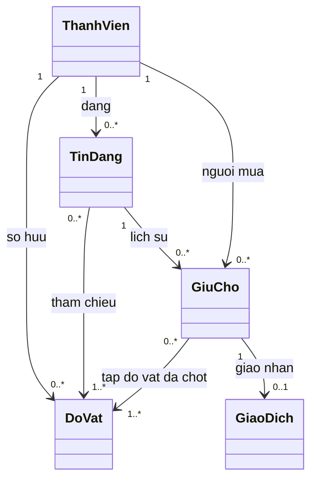
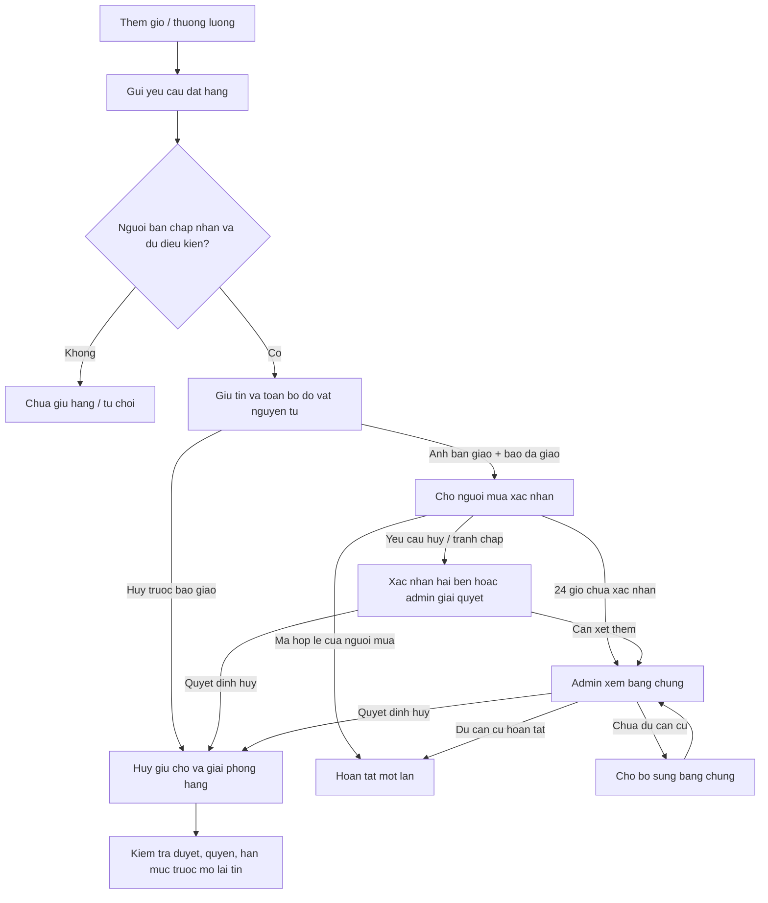
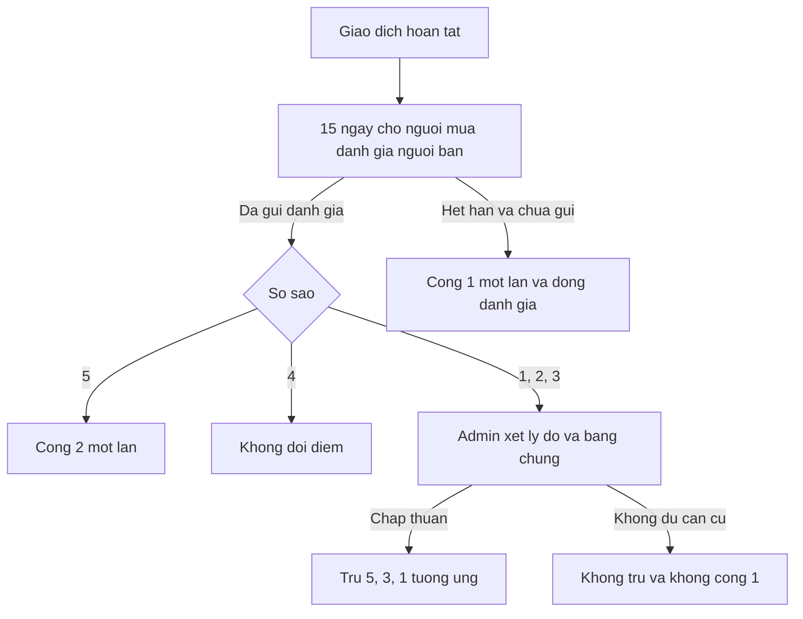

# Mô hình nghiệp vụ sau các quyết định P0

Ngày: 28/09/2026. Nguồn: [yêu cầu v1.1, S5/C11–C23](../product/client-requirements.md). Đây là mô hình phân tích minh họa các quy tắc đã chốt, **chưa phải thiết kế lớp/schema, máy trạng thái đầy đủ hoặc chức năng đã lập trình**. Chủ trì M2/M3/M4; M1 và M5 cùng review ranh giới quyền, điểm và kiểm duyệt. Không bao gồm đổi đồ chưa duyệt tại A17.

## Kho cá nhân và tin đăng — FR-04/08, A02/A19

- Các bội số giữ chỗ là **lịch sử**, không phải số được giữ đồng thời: tối đa một giữ chỗ có hiệu lực/tin và một giữ chỗ có hiệu lực/đồ vật. Đồ vật đã bán không được giữ lại qua tin khác.
- Một bản ghi kho đại diện một vật thực tế. Tin chỉ tham chiếu đồ vật của người bán đó. Combo có nhiều đồ vật, được giữ tất cả hoặc không giữ món nào. Người mua không có hạn mức số giữ chỗ.
- Sửa/rút xét **chính tin bị tác động**: tin B chưa được giữ vẫn được sửa/rút khi tin A đang giữ đồ vật chung. Bản sửa B phải qua duyệt; không được sửa thỏa thuận A hoặc giải phóng đồ vật của A. Quyền sửa dữ liệu kho dùng chung vẫn mở tại A14.
- Khi bàn bán qua tin A, combo B chứa bàn không còn đặt được nhưng không được ghi là một giao dịch đã hoàn tất. Trạng thái công khai/duyệt khác với khả năng còn hàng; cách hiển thị và đếm tin liên quan trong hạn mức cần hoàn thiện tại A14.

## Đặt hàng và giao nhận — FR-07–09, A04–A06

- Thêm giỏ, gửi yêu cầu và đồng ý giá không giữ hàng. Không có thanh toán trong ứng dụng.
- Không có tự hết hạn giữ chỗ. Mã xác nhận 6 số, 10 phút, tối đa 5 lần sai; cấp lại vô hiệu mã cũ nhưng không đổi mốc chuyển admin. Mốc 24 giờ tính từ ảnh + báo giao, không phải lúc chấp nhận giữ chỗ.
- Mã hủy khác mã hoàn tất; OTP không chứng minh trả hàng/hoàn tiền. Ai nhận/nhập mã hủy trong xác nhận hai bên còn mở tại A06. Sau báo giao không được đơn phương hủy trực tiếp.
- Admin quyết định theo bằng chứng; im lặng không tự hoàn tất. Buyer/admin/cancellation đồng thời phải dẫn đến một kết quả cuối nhất quán. Nhánh cần bổ sung không có thời hạn tự hoàn tất.
- Rút/ẩn tin không làm mất lịch sử. Gỡ tin đang có giao dịch và các trường hợp khóa vĩnh viễn còn mở tại A09/A14; sơ đồ không tự xác lập cách xử lý.

## Đánh giá và điểm — FR-10, A07/A08

Đánh giá đang chờ xét cũng là đã gửi, nên không đi vào nhánh +1. Tiến trình gửi đánh giá và tác vụ hết hạn phải loại trừ nhau. Quyền sửa đánh giá, mốc khiếu nại và hiển thị bản chờ xét/bị bác còn mở.

Một báo cáo đã xác minh có thể tạo tác động điểm **riêng** với đánh giá, nhưng mức phạt báo cáo chưa chốt. Không áp dụng −20 cũ cho không đến hẹn. Hai tác động cùng sự việc không đếm thành hai lần tái phạm; báo cáo trùng không nhân hình phạt.

## Hạn mức và hạn chế tài khoản — FR-05/12

Uy tín <120 cho phép 5 tin đang mở/giữ chỗ, >=120 cho phép 10. Giảm điểm giữ tin hiện có nhưng chặn công khai thêm khi chưa còn chỗ; không miễn ẩn do vi phạm. Khóa tạm 14 ngày ở 30 < điểm <=50; <=30 khóa vĩnh viễn có khiếu nại. Khóa tạm cho phép xử lý giao dịch đã giữ, chặn đăng/giữ mới. Hết 14 ngày không khóa lại chỉ theo điểm cũ; vi phạm mới được xét theo cùng ngưỡng, không có thang tăng nặng tái phạm riêng.

Các sơ đồ trên cần được cụ thể hóa thành use case khi triển khai. [Hợp đồng backend khởi tạo](../api/README.md) và [thiết kế schema/khóa giao dịch](../architecture/shared-domain-schema.md) bổ sung OpenAPI dự kiến, DTO và V2; endpoint nghiệp vụ chưa được triển khai. Các thiết kế này không tự phê duyệt phần nghiệp vụ còn mở.
